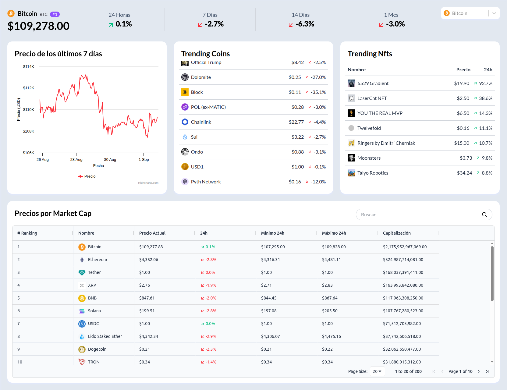

# Crypto dashboard solution

This is a challenge solution using the [Coingecko api](https://api.coingecko.com/api/v3/).

## Table of contents

- [Overview](#overview)
  - [Screenshot](#screenshot)
  - [Links](#links)
- [My process](#my-process)
  - [Built with](#built-with)
- [Author](#author)

## Overview

### Screenshot

### Links

- Solution URL: [https://github.com/michgidev/react-crypto-dashboard.git](https://github.com/michgidev/react-crypto-dashboard.git)
- Live Site URL: 

## My process

### Built with

- React + Vite
- CSS custom properties
- Tailwind
- Mobile-first workflow
- Dark theme
- Coingeko api

## Author

- Mich - [@michgidev](https://www.frontendmentor.io/profile/michgidev)